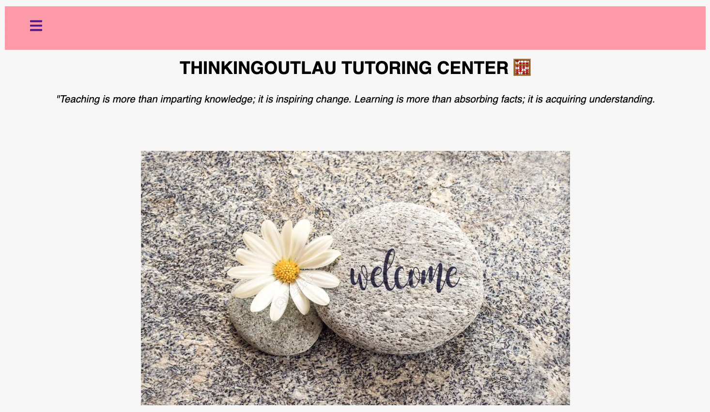

<h2>Thinkingoutlau Tutoring Center</h2>

Ever since I was an undergrad studying mathematics, I knew I wanted to open my own tutoring center one day. I love mathematics and had an even stronger love educating others in the one subject people struggled with the most. I've heard many times from students, and even friends, how much they dislike math. However, their reason is usually that math is too hard or that they just don't get it. My goal as a educator was to exposed them to the beauty of mathematics, hoping for those "aha" moments whether it be sooner or later.

As the years have passed, I had put this dream of mine on the side. Coming to terms with reality of the startup capital I needed in order to start a physical tutoring center was tough. Though that was the case, I was still content with educating the next generation, reaching as many students as possible. 

It wasn't until the pandemic did we realize that almost everything can be done remotely. Being on both sides, as a teacher and a student, teaching and learning through zoom were just as effective as in-person. Although there are some challenges with remote learning, there are also so many tools at our disposal that allow us to work effectively. And this was when I decided to create an online tutoring center, taking the first step toward the dream I had almost ten years ago.

 

 
<i>This will be a on-going project as I continue to add on and perfect it.</i>

